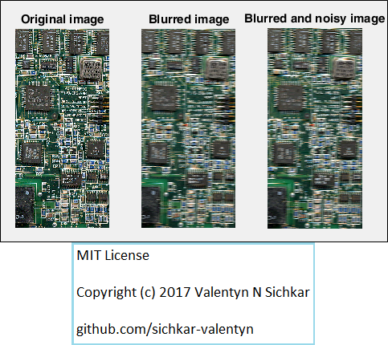
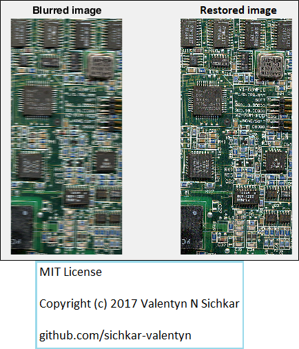
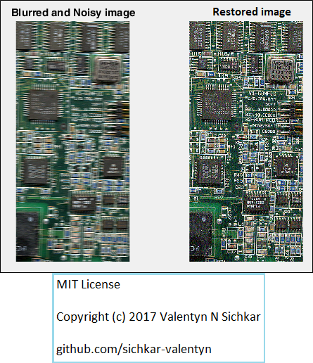
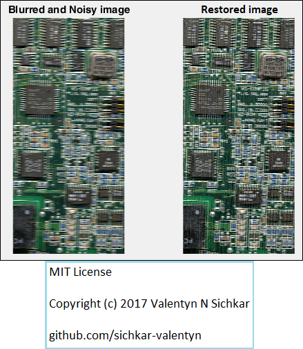

# Restoration of images in Matlab
Restoration of images in Matlab using inverse filtration technique

### Courses:
* Explore the course **"Convolutional Neural Networks for Image Classification"** here: https://stepik.org/course/53801/promo

### Reference to:
[1] Valentyn N Sichkar. Restoration of images in Matlab using inverse filtration technique // GitHub platform [Electronic resource]. URL: https://github.com/sichkar-valentyn/Restoration_of_images_in_Matlab (date of access: XX.XX.XXXX)

## Description
Restoration of image using different techniques in Matlab.

The main goals are:

<ul>
<li>Create a blurred image from original one</li>
<li>Add some random noise to the blurred image</li>
<li>Restore blurred image</li>
<li>Restored blurred and noisy image</li>
</ul>

## Original, Blurred and Noised images

## Blurred and Restored images

## Blurred-Noisy and Restored images by using ratio

## Blurred-Noisy and Restored images by using correlation function

## MIT License
## Copyright (c) 2017 Valentyn N Sichkar
## github.com/sichkar-valentyn
### Reference to:
[1] Valentyn N Sichkar. Restoration of images in Matlab using inverse filtration technique // GitHub platform [Electronic resource]. URL: https://github.com/sichkar-valentyn/Restoration_of_images_in_Matlab (date of access: XX.XX.XXXX)
